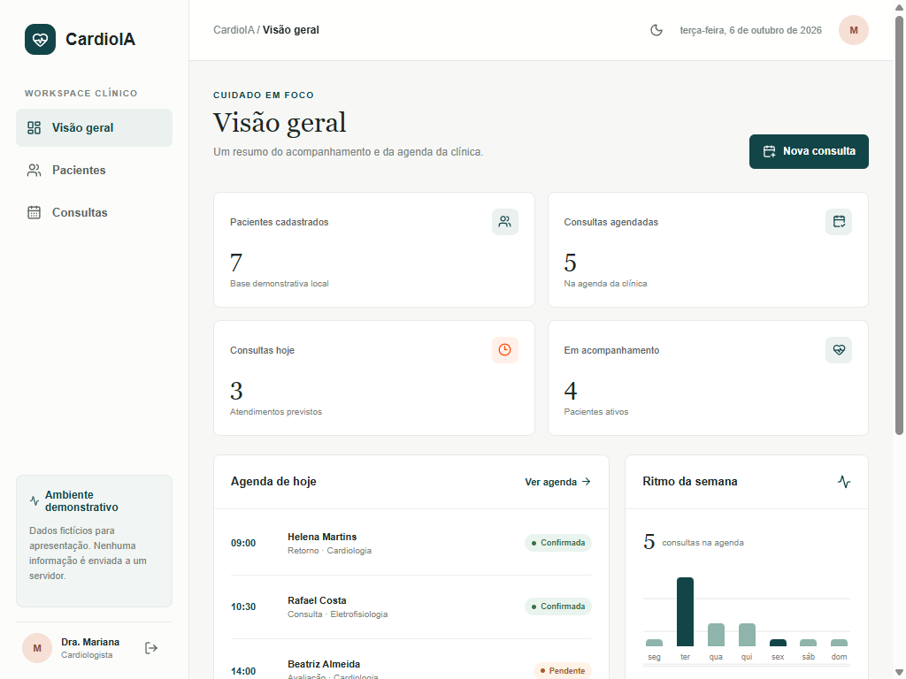
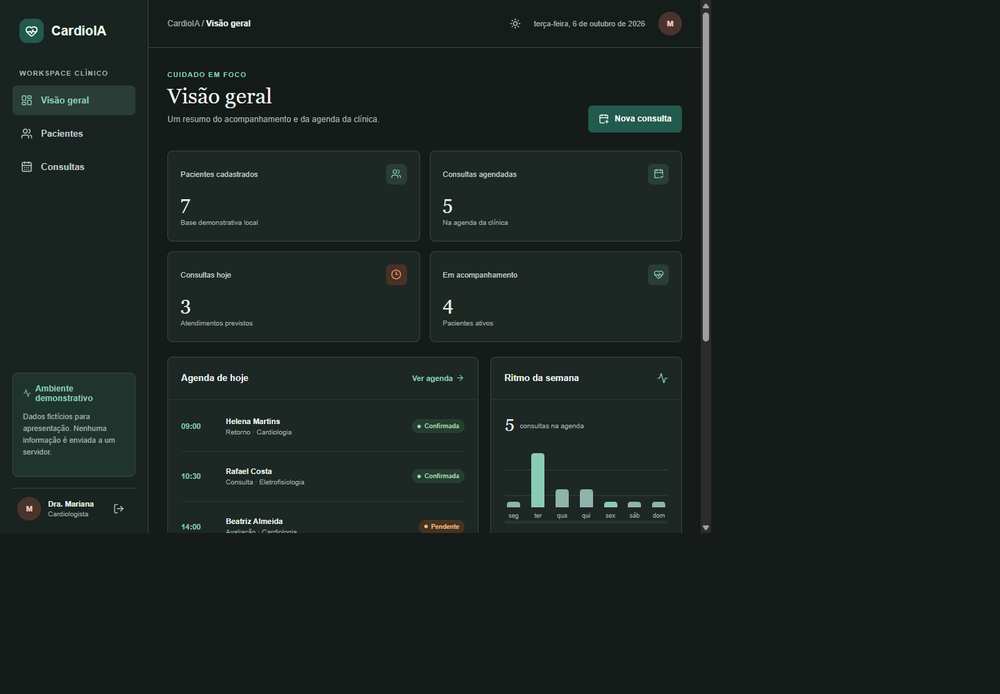
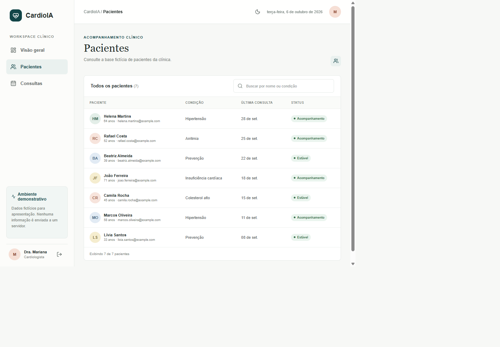
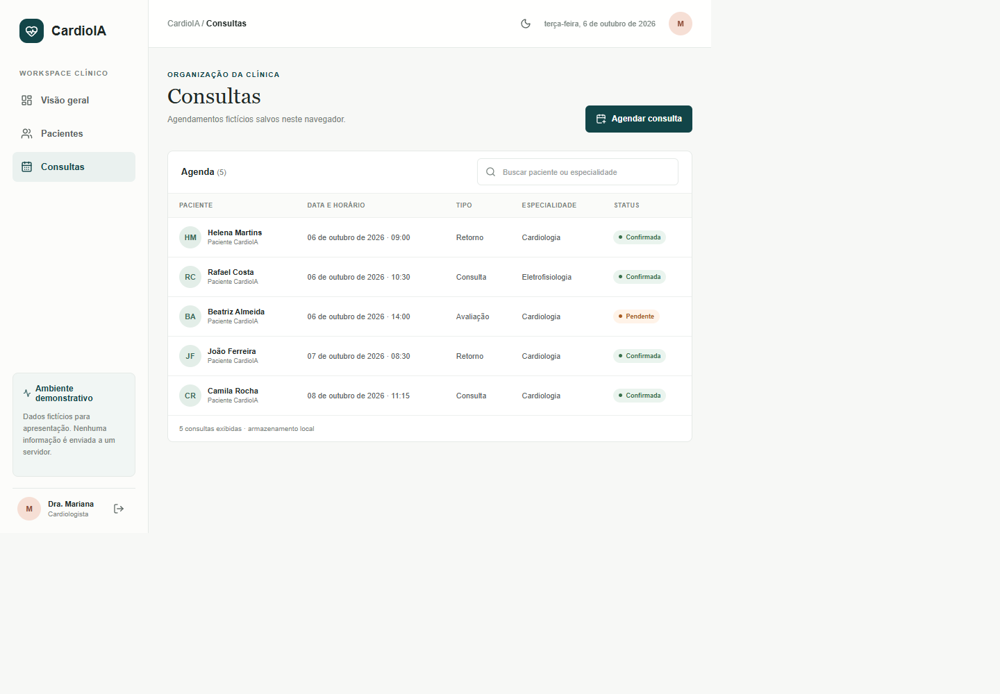

<div align="center">
  <h1>CardioIA</h1>
  <p>Portal demonstrativo para acompanhamento de pacientes fictícios, agenda e métricas de uma clínica de cardiologia.</p>
  <p><strong>React 19 · Vite 8 · React Router · ESLint</strong></p>
</div>

> **Protótipo acadêmico:** aplicação exclusivamente front-end, sem backend ou autenticação real. Todos os registros são fictícios.

## Integrantes

| Nome completo | RM |
|---|---|
| Caroline de Castro Corrêa | RM567255 |
| Enzo França Sader | RM566928 |
| Lucas Hideki Oliveira Koyama | RM566925 |
| Rodrigo Dias Figueiroa | RM567800 |
| Tiago Lindgren Curi | RM567016 |

## Capturas de tela

<table>
  <thead>
    <tr>
      <th>Dashboard · claro</th>
      <th>Dashboard · escuro</th>
    </tr>
  </thead>
  <tbody>
    <tr>
      <td></td>
      <td></td>
    </tr>
    <tr>
      <th>Pacientes</th>
      <th>Agenda de consultas</th>
    </tr>
    <tr>
      <td></td>
      <td></td>
    </tr>
  </tbody>
</table>

## Funcionalidades

- Login de demonstração com Context API e token JWT-shaped no `localStorage`.
- Rotas protegidas para as páginas que exibem dados fictícios.
- Pacientes carregados de JSON local e busca com `useDeferredValue`.
- Dashboard com contagens, agenda do dia e visualização semanal.
- Agendamento com `useState`, `useReducer`, validação de horários duplicados e persistência local.
- Alternância claro/escuro com preferência salva no navegador.
- Layout responsivo, CSS Modules e tokens globais de design.

## Tecnologias

| Tecnologia | Responsabilidade |
| --- | --- |
| React 19 | Interface, Context API e Hooks |
| Vite 8 | Servidor local e build de produção |
| React Router | Navegação e proteção de rotas |
| Lucide React | Ícones |
| ESLint | Lint do projeto |

## Executar localmente

Requisitos: Node.js 20.19+ ou 22.12+ e npm.

```bash
npm install
npm run dev
```

O Vite imprime a URL local ao iniciar. Antes de apresentar ou publicar alterações, valide com:

```bash
npm run lint
npm run build
```

## Acesso de demonstração

Abra `/login` e use o e-mail pré-preenchido ou qualquer e-mail válido. Não há senha. Acesse **Visão geral**, **Pacientes** e **Consultas** pela navegação.

## Organização

```text
src/
  components/   Navegação, tema e rota protegida
  context/      Sessão e preferência visual
  data/         Fixtures JSON e API simulada
  pages/        Login, dashboard, pacientes e consultas
  state/        Reducer e persistência dos agendamentos
  styles.css    Estilos compartilhados e responsivos
specs/
  cardioia-portal/  Especificação, plano e tarefas SDD
docs/
  screenshots/     Capturas incluídas neste README
```

## SDD

A especificação, o plano e os critérios de aceite ficam em [`specs/cardioia-portal/`](specs/cardioia-portal/). Atualize `spec.md`, `plan.md` e `tasks.md` antes de ampliar uma funcionalidade e registre as verificações ao concluir.

## Segurança e limites

O token local apenas simula uma sessão: não possui assinatura, não autentica usuários e não protege dados. Não adicione informações pessoais ou de saúde reais. O CardioIA é um exercício de interface e não deve ser usado para atendimento ou decisões clínicas.
